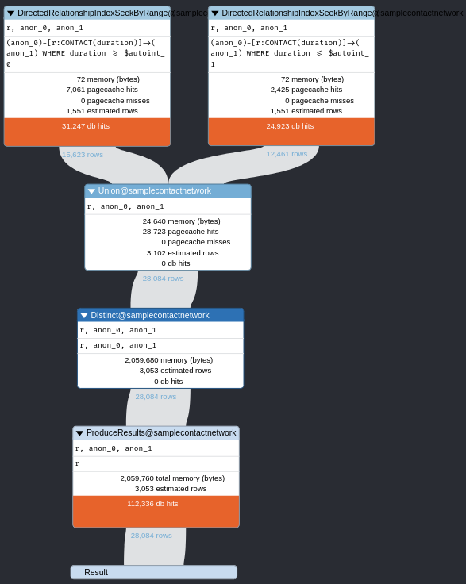

# Note for Neo4j

## Installation

Neo4j 4.3.5 only support JDK 11 (both OpenJDK and Oracle JDK will work). Though, this may bring some trouble in environment settings.
Community or Enterprise: https://neo4j.com/pricing/

Notice that the installation requires **administration privileges**. 

## Configuration

The configuration file of Neo4j is: 

```bash
/etc/neo4j/neo4j.conf
```

by default (Ubuntu 20.04), though it may change in other systems. During the runtime, Neo4j needs to access multiple folders, and by default they are:

```bash
home:         /var/lib/neo4j
config:       /etc/neo4j
logs:         /var/log/neo4j
plugins:      /var/lib/neo4j/plugins
import:       /var/lib/neo4j/import
data:         /var/lib/neo4j/data
certificates: /var/lib/neo4j/certificates
licenses:     /var/lib/neo4j/licenses
run:          /var/run/neo4j
```

And these paths can be changed in the configuration file. The Neo4j server needs to be restarted to turn the changes effective by executing:

```bash
neo4j restart
```

Also, as by default there is no on-screen log telling if the Neo4j server has been successfully started, it is necessary to check its status by executing:

```bash
neo4j status
```

Neo4j supports various plugins (e.g. APOC - Awesome Procedures On Cypher), and some of them are actually necessary. Though, Neo4j server does not include them by default, and we need to install them manually. The installation is actually simple, which is little beyond copying and pasting some Java jar files to the plugins folder as listed above. After that, we may need further configuration to the server. For example, as plugins are  sandboxed by default, we need to enable the following configuration (in the configuration file) so that they can pass through the sandbox.

```
dbms.security.procedures.unrestricted=apoc.*
```

The original explanation of this line is:

> A comma separated list of procedures and user defined functions that are allowed full access to the database through unsupported/insecure internal APIs.

As plugins are Java jar files, "apoc.*" means all packages inside the package "apoc" (in Java jargon). 

Another related configuration, which is optional, is:

```
dbms.security.procedures.allowlist=apoc.*,apoc.coll.*,apoc.load.*,gds.*
```

And the original explanation is:

> A comma separated list of procedures to be loaded by default. Leaving this unconfigured will load all procedures found.

In addition, some plugins are rather strict at version selection. For example, the version of APOC needs to match the version of Neo4j server exactly. In other words, if the Neo4j server is 4.3.x, then APOC has to be 4.3.x. Otherwise, the Neo4j server may have undefined behaviors. Also, some plugins may have multiple released jar files. Some of them are specific components, and some others are all-in-one packages. When choosing these files, we need to be careful. If we have two jar files containing overlapping functions (e.g. "apoc-4.3.0.3-all.jar" and "apoc-4.3.0.3-core.jar") in the plugins folder at the same time, the server may not be started successfully. 

## Concepts of Neo4j

For general ideas about Neo4j: https://neo4j.com/docs/getting-started/current/graphdb-concepts/

Why Graph Database? A big reason is that the data may not need to follow the same schemas. For example, in traditional relational databases, when defining "Person", a table with a schema is typically required, which conceptually looks like as follows:

```sql
Person
	pid: integer
	name: char[]
	age: integer
	address: char[]
```

In contrast, in Neo4j, a "Person" object needs not to have all of the attributes. For example, consider two "Person" nodes in Neo4j, and they may look like as follows:

```cypher
Person: 1 {pid: 1, name: "Alice", age: 16}
Person: 2 {pid: 2, name: "Bob", address: "City B"}
```

## Operations on Neo4j

### Constraints

As Neo4j graph database does not require to specify full schemas before adding in data, there must be a way to specify similar things such as property existence and data type, and it is **constraint**. Detailed description can be found here: https://neo4j.com/docs/cypher-manual/current/constraints/ 

Notice that *node property existence*, *relationship property existence* and *node key* constraints are only available in the *Enterprise* version of Neo4j. 

#### Indexes

Indexes in Neo4j are very similar to those in relational databases. Typically, it support a hash-like indexing (named **lookup**) and a btree-based indexing (named **btree**). In addition to these two types, Neo4j also supports a full-text indexing (named **fulltext**) powered by Apache Lucene. For example, a full-text indexing can be created upon the *title* property of nodes labeled as *Movie*, and help search efficiently on the contents of titles. 

To be cautious, as indexes are not idempotent by default, and some indexes may be created when creating constraints, we need to double check if an index has been created before putting into action. Otherwise, creating the same index more than once will lead to errors. 

#### Write

Efficiently adding nodes and edges into Neo4j graph database can be a tricky task. The command "**LOAD CSV**" can be an option but only for small- or medium-sized data (up to 10M records). Details can be found here: https://neo4j.com/developer/guide-import-csv/ Another option is processing the loading in code. 

1. Using "**MERGE**" without indexes

   The key issue of this method is the running time. As "**MERGE**" needs to check the existence of patterns, without proper indexing (typically no indexing at the initial data loading stage), its running time can be $O(N^2)$, though from the coding point of view "**MERGE**" does look more concise and convenient. Empirically, for $50,000$ data records, it takes about $1$ minute to create the graph. This is rather expensive. 
   
2. Using "**MERGE**" with indexes
    The key difference between this method and the first one is the indexing. Beforehand, the indexes can be created without having concrete data records in the graph database. The indexes then will be updated by the server when adding in new data. The triggers of updating is configurable, and more details can be found here: https://neo4j.com/docs/operations-manual/current/performance/statistics-execution-plans/ The empirical running time, with the same settings as those in the first method, is about 6 seconds. With committing by batch, the running time will not be better, though batching can be helpful in lowering the risk of singleton failure caused by for example out of memory. 

2. Using "**MATCH**" and "**CREATE**"

   In this way, we add in unique nodes firstly (only using "**CREATE**"), then add in edges (using both "**MATCH**" and "**CREATE**"). With the same settings, it takes about 6 seconds to create the same graph without indexes. 
   

**!!!CAUTION!!!**

The third method may lead to different results from the first two. "**MERGE**" always searches for existing nodes or edges matching the given patterns. If found, then the user can choose what to do next, for example, updating the found nodes or edges. Otherwise, it will create a new node or edge. Thus, when constructing a multi-graph, "**MERGE**" may not behave as expected if not being used appropriately. On the other hand, "**CREATE**" will straightforwardly create nodes and edges regardless of the current graph, and each created node or edge will be assigned a unique ID. This unique ID is not controllable from the user end. 

**!!!CAUTION!!!**

When purging the Neo4j DB, "**DELETE**" can be very expensive on both time and memory. If we have to, "**DROP DATABASE**" may be a better option.

## Query Execution

Each Cypher query will be decomposed into *operations*, and these operations will be organized into a tree-like structure which is called an **execution plan**. For example, consider the following query:

```cypher
match ()-[r:CONTACT]->() where r.duration >= 10000 or r.duration <= 1000 return r
```

This query returns all *relationships* (i.e. edges), labeled as "CONTACT", whose durations are either greater or equal to $10,000$ or less or equal to $1,000$. The execution plan of this query is visualized in **Figure 5.1**:



*Figure 5.1 An example of execution plan.*

**!!!CAUTION!!!**

When retaining query results in Python, it is safer to use `neo4j.Result.values()` instead of `neo4j.Result.data()` because the latter function may miss some data (e.g. properties of edges) in its return. This could be a bug of the Python neo4j library. The key difference between these two functions is that the former one does not support named returned items but the latter does. 

**!!!CAUTION!!!**

When committing nodes or edges to Neo4j, batching is necessary. If a commit contains too many records, this commit may not fail but it may happen that nothing is added to Neo4j. 

## Using Docker

To start a Neoj4 server instance with Docker on Rivanna, we firstly need to enter the folder `/project/biocomplexity/mf3jh`, and then run the following command:

```bash
singularity instance start --env=NEO4J_ACCEPT_LICENSE_AGREEMENT=yes --writable-tmpfs  --bind neo4j_data:/project/biocomplexity/mf3jh /project/biocomplexity/singularity_images/neo4j-enterprise.sif neo4j
```

Notice that the folder we are at running the command need to be consistent with the folder specified by the `--bind` parameter, otherwise it will fail. To stop the Neo4j instance, we run the following command:

```
singularity instance stop neo4j
```


## Potential Issues

1. As Neo4j needs to store a lot of more meta-data of graph databases, the space consumption is non-trivial. We may need to pre-calculate the space consumption before deploying the server. Neo4j provides a tool to calculate space consumption: https://neo4j.com/hardware-sizing/ Here is a brief explanation by examples of how Neo4j stores data: https://neo4j.com/developer/kb/understanding-data-on-disk/
2. Neo4j runs in JVM. It would be necessary to pre-calculate the memory consumption and set up the memory usage of JVM before starting the server. W.r.t. memory consumption, this article from Neo4j is helpful: https://neo4j.com/developer/kb/understanding-memory-consumption/
3. Some core mechanisms of Neo4j such as execution planning, GC and indexing are also configurable depending on application scenarios. We may need to dig them deeply to understand what is the best practice.
4. The performance of Graph Data Science Library (GDSL) is not fully understood yet. There may be some trade-off between directly utilizing GDSL and applying algorithms from other sources to have good performance.  


## Better Practice

1. Add these to settings:

   ```
   apoc.import.file.enabled=true
   
   dbms.memory.heap.initial_size=31g
   dbms.memory.heap.max_size=31g
   
   dbms.memory.pagecache.size=80g
   ```

2. Import PERSON nodes:

   ```
   CALL apoc.periodic.iterate("CALL apoc.load.csv('file:///import/person_trait.csv') yield map as rec return rec","create (n:PERSON {pid: rec.pid, hid: rec.hid, age: rec.age, age_group: rec.age_group, 
   gender: rec.gender, fips: rec.fips, home_lat: rec.home_lat, home_lon: rec.home_lon, 
   admin1: rec.admin1, admin2: rec.admin2, admin3: rec.admin3, admin4: rec.admin4})",{parallel:true,batchSize:100000,concurrency:6})
   ```

3. Import Initial Contact Network

    ```
    xsv sort initial_network.csv > initial_network_sorted.csv
```
    
```
    CALL apoc.periodic.iterate("CALL apoc.load.csv('file:///import/initial_network_sorted.csv') yield map as rec return rec",
    "match (src:PERSON), (trg:PERSON) where src.pid=rec.sourcePID and trg.pid=rec.targetPID create (src)-[r:CONTACT {occur: -1, src_act:rec.sourceActivity, trg_act:rec.targetActivity, duration:rec.duration}]->(trg)",
{parallel:true,batchSize:200000,concurrency:4})
```

4. Import Intermediate Network

   ```
   CALL apoc.periodic.iterate("CALL apoc.load.csv('file:///import/intermediate_network_0_sorted.csv') yield map as rec return rec",
   "match (src:PERSON), (trg:PERSON) where src.pid=rec.sourcePID and trg.pid=rec.targetPID create (src)-[r:CONTACT {occur: 0, src_act:rec.sourceActivity, trg_act:rec.targetActivity, duration:rec.duration}]->(trg)",
   {parallel:true,batchSize:200000,concurrency:4})
   ```

   
